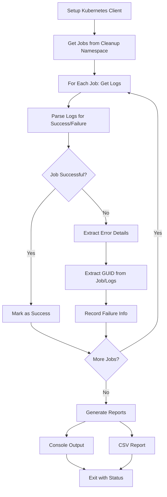
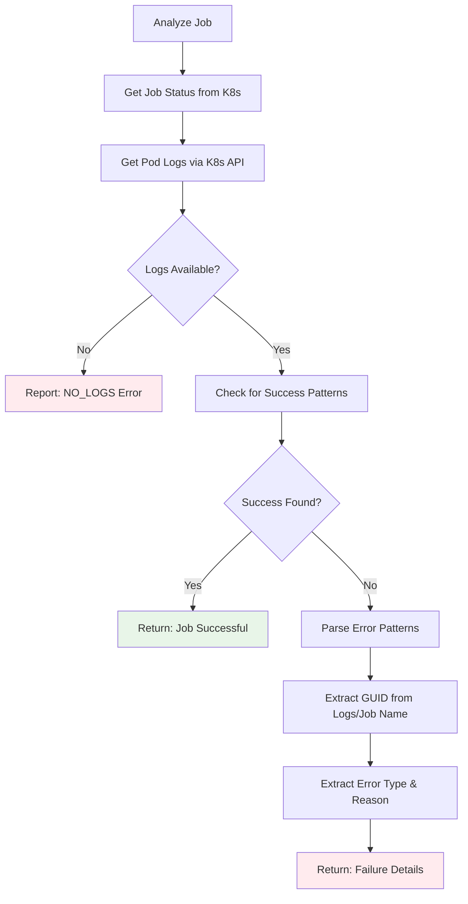

# ODF Cleanup Monitor Script Documentation

## Overview
The `odf-cleanup-monitor.py` script monitors ODF cleanup jobs in OpenShift and reports failures. It analyzes job logs to identify failed cleanup operations and generates reports for manual intervention.

## Assumptions
- OpenShift cleanup jobs run in a dedicated namespace (default: "cleanup")
- Jobs are triggered by lab deletion events with LAB GUID in job name or logs
- Log patterns follow odf-cleanup.py output format
- Kubernetes/OpenShift API access via service account or kubeconfig
- Job logs contain either success patterns or error details for analysis

## Execution Flow
```
main() → CleanupJobMonitor() → get_cleanup_jobs() → analyze_job() → generate_reports()
```

### High-Level Execution Flow Diagram



---

### Job Analysis Process



---

## Core Functionality

**CleanupJobMonitor Class:**
- Connects to OpenShift via kubernetes library (in-cluster or kubeconfig)
- Gets all jobs from specified namespace (default: "cleanup")
- Analyzes job logs for success/failure patterns
- Extracts LAB GUID from job names or volume names in logs
- Generates console and CSV reports

**Key Methods:**
- `get_cleanup_jobs()` - Lists jobs via Kubernetes BatchV1Api
- `get_job_logs()` - Retrieves pod logs via CoreV1Api  
- `analyze_job()` - Parses logs for success/error patterns
- `extract_guid_from_logs()` - Finds GUID from `ocp4-cluster-{GUID}-{UUID}` patterns
- `parse_error_details()` - Extracts ERROR/FAILED/WARNING messages

**Success Patterns:** 
- `SUCCESS: No objects with GUID found in pool`
- `Cleanup completed successfully for LAB GUID`

**Error Patterns:**
- `ERROR: {message}`
- `FAILED: {message}` 
- `Warning: {count} items still failed`

**Output Formats:**
- **Console**: Summary with `[v]` success, `[x]` failure markers
- **CSV**: Structured data (job_name, guid, status, error_type, error_reason)

**Usage:**
```bash
# Monitor cleanup namespace
python3 utils/odf-cleanup-monitor.py

# Different namespace with debug
python3 utils/odf-cleanup-monitor.py --namespace my-cleanup --debug

# CSV output only
python3 utils/odf-cleanup-monitor.py --format csv --csv failures.csv
```

**Exit Codes:**
- `0` - No failures found
- `1` - Cleanup failures detected