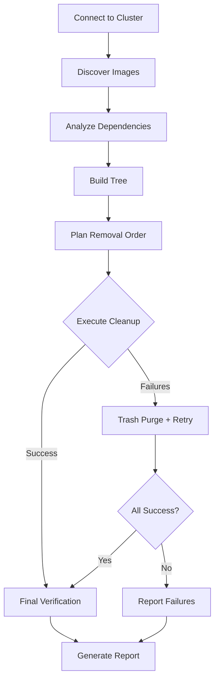
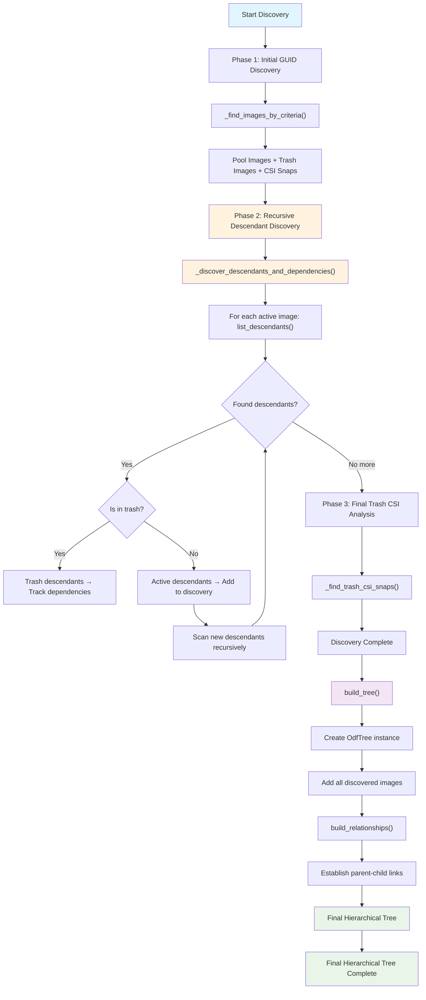
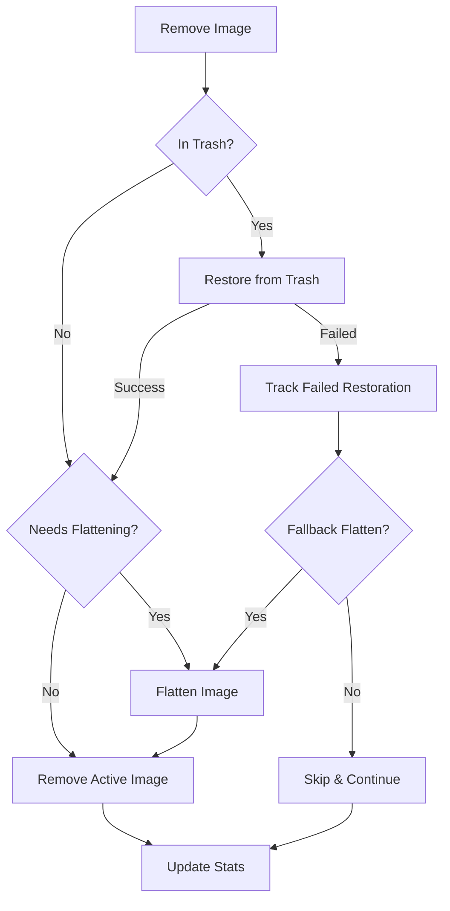
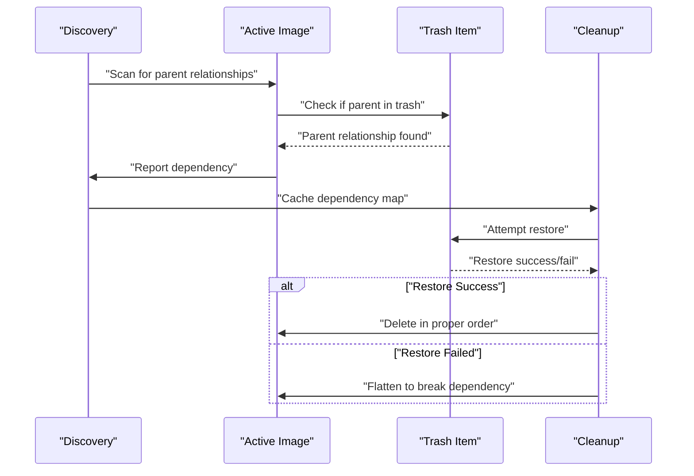

# ODF Cleanup Script Documentation

## Overview
The `odf-cleanup.py` script deletes ODF (OpenShift Data Foundation) RBD objects based on a LAB GUID using a hierarchical tree approach. It handles complex dependencies between volumes, snapshots, and trash items.

## Execution Flow
```
main() → OdfCleaner.cleanup() → connect() → discover_images() → build_tree() → plan_removal() → execute_cleanup()
```

---

### High-Level Execution Flow Diagram



--- 

### Hierarchy Build-up Process



**Example Tree Structure Result:**
```
Root Image A
       └─ Child Images (lv 2)
                    └─ Grandchild Images (lv 3)
                             └─ level 4+...

Root Image B
       └─ Child Images (lv 2)
                    └─ Grandchild Images (lv 3)
                             └─ level 4+...
```

---

**Summary:** Flattening is essentially the "Plan B" when the preferred method (trash restoration) fails, ensuring cleanup can still proceed even with complex dependency chains.

### Image Removal Decision Flow



### Restoration Failure Handling Decision 

#### **Tier 2: Fallback Method (Flattening)**
- **Goal:** Break dependencies when trash restoration fails
- **Process:** When trash restoration fails:
  1. Flatten the active image using `_flatten_image()`
  2. This removes the parent relationship entirely
  3. Image becomes independent and can be deleted without dependencies
  4. The failed trash items are left in trash but marked as handled

### Dependency Resolution Sequence




---

## Classes

### 1. `ImageType(Enum)`
**Purpose:** Defines types of RBD images/objects
- `VOLUME` - Regular RBD volume
- `CSI_SNAP` - CSI snapshot
- `INTERNAL_SNAP` - Internal snapshot
- `TRASH_VOLUME` - Volume in trash
- `TRASH_CSI_SNAP` - CSI snapshot in trash

### 2. `OdfImage`
**Purpose:** Represents an RBD image (volume or snapshot) with metadata and relationships

#### Constructor `__init__()`
- Initializes image properties (name, type, size, creation time, parent, protection status, trash status)
- Sets up dependency tracking flags for multi-phase operations

#### Methods:
- `add_child()` - Adds child image to establish parent-child relationship
- `has_descendants()` - Checks if image has children or internal snapshots
- `get_all_descendants()` - Recursively gets all descendant images

### 3. `OdfTree`
**Purpose:** Manages hierarchical tree structure of ODF RBD images

#### Constructor `__init__()`
- Initializes empty tree with image dictionary and root images list

#### Methods:
- `add_image()` - Adds image to tree and establishes parent relationships if parent exists
- `build_relationships()` - Builds parent-child relationships after all images are added
- `get_removal_order()` - Calculates deletion order using depth-first post-order traversal (children first)
- `display_tree()` - Shows tree structure with visual hierarchy
- `_display_image()` - Recursive helper for tree display with details
- `_format_size()` - Converts bytes to human-readable format (B/KB/MB/GB/TB/PB)

### 4. `OdfCleaner`
**Purpose:** Main orchestrator for ODF cleanup operations

#### Constructor `__init__()`
- Initializes cleanup state, statistics, and caching variables
- Sets dry-run mode and initializes connection variables

---

## OdfCleaner Methods (Execution Order)

### Phase 1: Connection & Discovery

#### `connect()`
**When:** First step in cleanup process
**Purpose:** Establishes connection to ODF cluster using environment variables
**Does:** 
- Reads CL_POOL, CL_CONF, CL_KEYRING, CL_LAB from environment
- Creates Rados cluster connection and IO context
- Returns success/failure status

#### `discover_images()`
**When:** After successful connection
**Purpose:** Finds all RBD images related to LAB GUID
**Does:**
- **Phase 1**: Calls `_find_images_by_criteria()` for pool images, trash images, and CSI snaps
- **Phase 2**: Calls `_discover_descendants_and_dependencies()` for comprehensive descendant analysis and trash dependency tracking
- **Phase 3**: Analyzes final trash csi-snaps via `_find_trash_csi_snaps()`
- Returns complete list of discovered OdfImage objects

#### `_find_images_by_criteria()`
**When:** Called by discover_images()
**Purpose:** Generic method to find images based on source and criteria
**Does:**
- Searches pool or trash based on source parameter
- Filters by GUID and CSI-snap criteria
- Creates OdfImage objects using `_create_image_from_rbd()` or `_create_trash_image()`

#### `_find_trash_csi_snaps()`
**When:** During discovery phase
**Purpose:** Finds CSI snapshots in trash that have active dependencies
**Does:**
- Gets trash items with 'csi-snap' in name
- Uses cached dependency analysis to determine which are referenced
- Returns list of referenced trash CSI snapshots

#### Helper Methods for Discovery:
- `_is_image_in_trash()` - Checks if image exists in trash
- `_is_trash_item_referenced()` - Checks if trash item is referenced by active images
- `_create_image_from_rbd()` - Creates OdfImage from active RBD image with full metadata
- `_create_trash_image()` - Creates OdfImage from trash item

### Phase 2: Comprehensive Descendant Analysis

#### `_discover_descendants_and_dependencies()`
**When:** After initial GUID-based discovery (Phase 1)
**Purpose:** Recursively scans for missing descendants and tracks trash dependencies in a single optimized scan
**Does:**
- Scans `list_descendants()` of all discovered active images
- **Active descendants**: Includes ALL found descendants in discovery list for tree hierarchy
- **Trash descendants**: Tracks as dependencies only (no discovery, different cleanup method)
- Continues recursively until no new descendants are found
- Returns tuple: `(additional_images, active_to_trash_dependencies)`
- Prevents "still has descendants" errors by finding all blocking children

**Key Algorithm:**
```python
while images_to_scan:
    current_batch = []
    for image in images_to_scan:
        descendants = list(img.list_descendants())
        for desc in descendants:
            if desc.get('trash', False):
                # Track trash dependency only
                active_to_trash_deps[image.name].append(desc_name)
            else:
                # Add active descendant to discovery
                if desc_name not in discovered_names:
                    current_batch.append(new_image)
    images_to_scan = current_batch  # Continue scanning new descendants
```

**Key Optimization:** Single RBD API scan replaces duplicate calls from separate descendant discovery and dependency analysis methods.

**Problem Solved:** 
- **Race Condition Prevention**: Discovery-time relationships vs deletion-time relationships
- **Complete Hierarchy Building**: Ensures tree shows all blocking relationships
- **Runtime Blocking Detection**: Finds descendants that block deletion regardless of naming patterns

**Example Output:**
```
Phase 2: Scanning for missing descendants...
  Found 1 new images to scan for descendants...
  Recursive scan complete: found 2 total missing descendants
  Found 3 active->trash dependencies
```

### Phase 3: Tree Building & Planning

#### `build_tree()`
**When:** After discovery
**Purpose:** Builds hierarchical relationship tree
**Does:**
- Adds all discovered images to OdfTree
- Calls tree.build_relationships() to establish parent-child links
- Provides debug output if enabled

#### `plan_removal()`
**When:** After tree building
**Purpose:** Determines optimal deletion order
**Does:**
- Calls tree.get_removal_order() for children-first ordering
- Displays planned removal sequence
- Returns ordered list of images for deletion

### Phase 4: Execution

#### `execute_cleanup()`
**When:** After planning
**Purpose:** Orchestrates the actual cleanup process
**Does:**
- Shows dry-run simulation OR executes live deletion
- Handles initial cleanup batch
- Implements retry strategy with trash purge for failures
- Calls final verification and report generation

#### `_execute_removal_batch()`
**When:** During cleanup execution and retries
**Purpose:** Removes a batch of items with dependency handling
**Does:**
- Marks images needing flattening based on dependencies
- Calls `_remove_image()` for each item
- Updates removal statistics
- Returns count of failed removals

#### `_remove_image()`
**When:** For each image during batch removal
**Purpose:** Removes a single RBD image with proper dependency handling
**Does:**
- Restores from trash if needed (`_restore_from_trash()`)
- Flattens image if needed (`_flatten_image()`)
- Removes active image (`_remove_active_image()`)

#### Image Removal Helpers:
- `_restore_from_trash()` - Temporarily restores trash items for deletion
- `_flatten_image()` - Flattens images to remove parent dependencies
- `_wait_for_flatten_completion()` - Waits for flatten operation to complete
- `_remove_active_image()` - Removes active RBD images after dependency resolution
- `_remove_internal_snapshots()` - Removes and unprotects internal snapshots

### Phase 5: Recovery & Verification

#### `_purge_expired_trash()`
**When:** During retry strategy for failed removals
**Purpose:** Clears expired trash items that may be blocking cleanup
**Does:**
- Executes RBD trash purge operation
- Returns success/failure for retry decision

#### Dependency Analysis Helpers:
- `_needs_flattening_for_dependencies()` - Checks if image needs flattening based on dependency analysis
- `_needs_fallback_flattening()` - Checks if flattening needed due to failed trash restorations
- `_item_still_exists()` - Verifies if item still exists after operations

### Phase 6: Reporting & Verification

#### `_final_verification()`
**When:** After successful cleanup (no failures)
**Purpose:** Ensures no objects with LAB GUID remain
**Does:**
- Scans pool and trash for remaining objects with GUID
- Attempts final cleanup of any remaining items
- Reports final cleanup status

#### `_generate_report()`
**When:** At end of cleanup process
**Purpose:** Generates comprehensive cleanup report
**Does:**
- Shows removal statistics, failed items, and final status
- Calls `_final_verification()` if cleanup was successful

#### Utility Methods:
- `_clear_dependency_cache()` - Resets cached dependency analysis
- `_update_removal_stats()` - Updates removal counters by image type

---

## Main Entry Point

### `main()`
**Purpose:** Script entry point and configuration validation
**Does:**
- Validates required environment variables (CL_LAB, CL_POOL, CL_CONF, CL_KEYRING)
- Configures dry-run and debug modes
- Creates OdfCleaner instance and runs cleanup
- Returns exit code based on success/failure

---

## Key Features

### Multi-Phase Operations
- **Dependency Resolution:** Handles active images that depend on trash items
- **Recursive Descendant Discovery:** Finds all blocking relationships via comprehensive scanning
- **Trash Restoration:** Temporarily restores trash items for proper deletion
- **Flattening:** Removes parent dependencies before deletion
- **Retry Strategy:** Uses trash purge and retries for failed operations
- **Recursive Descendant Discovery:** Finds all blocking relationships via comprehensive scanning

### Safety Features
- **Dry Run Mode:** Simulates operations without actual deletion
- **Hierarchical Deletion:** Removes children before parents
- **Dependency Tracking:** Prevents deletion of items with active dependencies
- **Final Verification:** Ensures complete cleanup

### Error Handling
- **Failed Restoration Tracking:** Tracks trash items that couldn't be restored
- **Fallback Flattening:** Flattens active images when trash restoration fails
- **Comprehensive Reporting:** Details all operations and failures

---

## Workflow Decisions

### Flattening Decision Process

The cleaner decides an image needs flattening through two main mechanisms:

#### 1. Primary Check: `_needs_flattening_for_dependencies()`
- Uses the cached `_active_to_trash_dependencies` map built during discovery
- If the image appears as an **active image** in this dependency map, it needs flattening
- This means the active image has parent relationships to trash items

#### 2. Fallback Check: `_needs_fallback_flattening()`
- Triggered when trash restoration fails
- Checks if the image depends on any items in `_failed_trash_restorations`
- If yes, forces flattening as a backup strategy

### Dependency Handling Strategy

The cleaner uses a **two-tier approach** to handle dependencies:

#### **Tier 1: Preferred Method (Trash Restoration)**
- **Goal:** Restore trash parent items temporarily so they can be properly deleted
- **Process:** When removing an image that depends on trash items:
  1. First restore the trash parents using `_restore_from_trash()`
  2. This allows proper hierarchical deletion (children → parents)
  3. Delete the restored items in correct order

#### **Tier 2: Fallback Method (Flattening)**
- **Goal:** Break dependencies when trash restoration fails
- **Process:** When trash restoration fails:
  1. Flatten the active image using `_flatten_image()`
  2. This removes the parent relationship entirely
  3. Image becomes independent and can be deleted without dependencies
  4. The failed trash items are left in trash but marked as handled

#### **Key Point:**
The dependency analysis happens **during discovery** via `_discover_descendants_and_dependencies()`, which scans all LAB images for parent relationships to trash items. This creates the dependency map that drives all flattening decisions later.

**Summary:** Flattening is essentially the "Plan B" when the preferred method (trash restoration) fails, ensuring cleanup can still proceed even with complex dependency chains.### Restoration Failure Handling Decision

#### Decision Mechanisms:
- **Failure Detection:** `_restore_from_trash()` returns False
- **Graceful Degradation:** Return True to continue cleanup despite failure

#### Strategy:
- **Continue-with-Fallback Approach:** Don't let trash restoration failures block overall cleanup
- **Process:** Track failed restorations → enable fallback flattening for dependents → continue cleanup
- **Outcome:** Failed trash items remain in trash, dependent images use flattening instead

#### **Key Point:**
This decision prioritizes **cleanup completion over perfection**. Rather than failing the entire cleanup when trash restoration fails, the system gracefully degrades to use flattening as an alternative path, ensuring LAB cleanup can still proceed.

### Trash CSI-Snap Inclusion Decision

#### Decision Mechanisms:
- **Primary Check:** `_find_trash_csi_snaps()` filters trash items with 'csi-snap' in name
- **Secondary Check:** `_is_trash_item_referenced()` uses cached dependency analysis

#### Strategy:
- **Inclusion Logic:** Only include trash CSI-snaps that appear in `_active_to_trash_dependencies` map
- **Process:** Scan trash CSI-snaps → check if referenced by active LAB images → include or skip
- **Outcome:** Referenced items targeted for cleanup, unreferenced items left in trash

#### **Key Point:**
This decision relies on the **cached dependency analysis** from `_discover_descendants_and_dependencies()`. Without this pre-computed map, the system couldn't determine which trash CSI-snaps are actually needed for LAB cleanup.

### CSI-Snap Parent Relationship Decision

#### Decision Mechanisms:
- **Primary Filter:** GUID presence in CSI-snap name
- **Exception Handler:** `img.parent_info()` check for skipped CSI-snaps

#### Strategy:
- **Indirect Ownership Detection:** Include CSI-snaps that belong to LAB through parent relationship
- **Process:** Apply GUID filter → check parent of filtered items → include if parent belongs to LAB
- **Outcome:** Captures orphaned CSI-snaps that inherit LAB ownership

#### **Key Point:**
This decision handles the **naming inconsistency** where CSI-snaps may not contain the LAB GUID in their names but still belong to the LAB through parent relationships. Without this check, legitimate LAB objects would be missed.

### Retry Strategy Decision

#### Decision Mechanisms:
- **Failure Detection:** `initial_failed_count > 0` after initial cleanup batch
- **Recovery Attempt:** `_purge_expired_trash()` to clear blocking items
- **Re-evaluation:** `_item_still_exists()` checks which failures persist

#### Strategy:
- **Purge-and-Retry Approach:** Use trash purge to clear blockers, then retry remaining failures
- **Process:** Execute purge → identify items cleaned by purge → retry only persistent failures
- **Outcome:** Either complete success or documented permanent failures

#### **Key Point:**
The retry strategy assumes that **expired trash items** may be blocking cleanup operations. The system attempts one global trash purge before giving up, treating this as the definitive recovery attempt. 

### Recursive Descendant Discovery Decision

#### Decision Mechanisms:
- **Runtime vs Discovery-time Relationships:** `list_descendants()` reveals blocking relationships that `parent_info()` misses
- **Comprehensive Scanning:** Recursively scan all discovered active images for descendants
- **Dual Purpose:** Single method handles both descendant discovery AND trash dependency tracking

#### Strategy:
- **Problem:** Discovery-time parent relationships don't match deletion-time blocking relationships
- **Solution:** Use `list_descendants()` to find ALL items that would block deletion
- **Optimization:** Merge descendant discovery with dependency analysis to eliminate duplicate RBD API calls

#### **Key Point:**
This decision prioritizes **complete hierarchy discovery** over performance. The recursive scan ensures no blocking descendants are missed, preventing "still has descendants" errors during deletion regardless of naming inconsistencies or race conditions.

