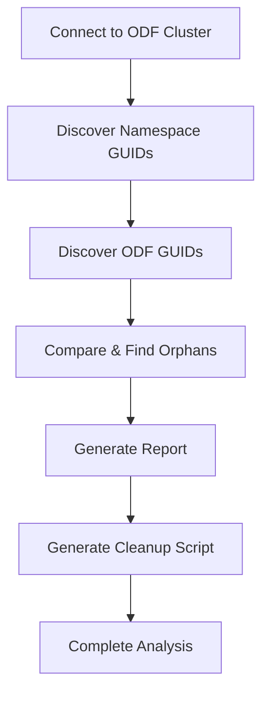

# ODF-OpenShift Comparator Script Documentation

## Overview
The `odf-oc-compare.py` script compares OpenShift namespaces with ODF (OpenShift Data Foundation) RBD images to identify orphaned lab GUIDs. It discovers active lab environments from OpenShift and compares them with ODF storage volumes to find orphaned storage that can be safely cleaned up.

## Execution Flow
```
main() → OdfOpenShiftComparator.run_comparison() → connect_odf() → discover_namespace_guids() → discover_odf_guids() → compare_and_find_orphans() → generate_report() → generate_cleanup_script()
```

### High-Level Execution Flow Diagram



---

## Classes

### 1. `OdfOpenShiftComparator`
**Purpose:** Main orchestrator for comparing ODF volumes with OpenShift namespaces

#### Constructor `__init__()`
- Initializes connection variables and result sets
- Sets up caching for expensive operations (CSI snap lookups, image lists)
- Initializes statistics tracking

#### Key Properties:
- `active_namespace_guids` - Set of GUIDs found in active namespaces
- `odf_guids` - Set of GUIDs found in ODF storage
- `orphaned_guids` - Set of GUIDs present in ODF but not in active namespaces
- `csi_snap_guid_cache` - Cache for CSI snapshot parent lookups
- `parentless_csi_snaps` - Analysis of CSI snapshots without parents

---

## OdfOpenShiftComparator Methods (Execution Order)

### Phase 1: Connection

#### `connect_odf()`
**When:** First step in comparison process
**Purpose:** Establishes connection to ODF cluster using environment variables
**Does:**
- Reads CL_POOL, CL_CONF, CL_KEYRING from environment
- Creates Rados cluster connection and IO context
- Validates client credentials from keyring file
- Returns success/failure status

### Phase 2: Discovery

#### `discover_namespace_guids()`
**When:** After successful ODF connection
**Purpose:** Discovers active lab GUIDs from OpenShift namespaces
**Does:**
- Loads kubeconfig and creates Kubernetes client
- Lists all namespaces in the cluster
- Extracts GUIDs using pattern: `sandbox-{GUID}-*`
- Populates `active_namespace_guids` set
- Updates statistics for namespace discovery

#### `discover_odf_guids()`
**When:** After namespace discovery
**Purpose:** Discovers all lab GUIDs from ODF RBD images and snapshots
**Does:**
- Lists all active RBD images in the pool
- Lists all trash items in the pool
- Processes each image through `_extract_guid_from_image()`
- Handles special case of CSI snapshots via parent lookups
- Caches results for performance optimization
- Updates statistics for ODF discovery

#### Helper Methods for Discovery:
- `_extract_guid_from_image()` - Extracts GUID from image name using regex patterns
- `_get_guid_from_csi_snap_parent()` - Gets GUID from CSI snapshot's parent (with caching)
- `_analyze_parentless_csi_snap()` - Analyzes CSI snapshots that have no parent
- `_extract_guid_from_name()` - Generic GUID extraction utility

### Phase 3: Analysis

#### `compare_and_find_orphans()`
**When:** After both discovery phases complete
**Purpose:** Compares namespace GUIDs with ODF GUIDs to identify orphans
**Does:**
- Performs set subtraction: `odf_guids - active_namespace_guids`
- Populates `orphaned_guids` set
- Updates orphan statistics
- Provides summary of comparison results

#### Analysis Helper Methods:
- `_count_odf_items_for_guid()` - Counts volumes, snapshots, and trash items per GUID
- `_order_guids_by_complexity()` - Orders orphaned GUIDs by cleanup complexity

### Phase 4: Reporting

#### `generate_report()`
**When:** After orphan analysis
**Purpose:** Generates comprehensive comparison report
**Does:**
- Reports orphaned GUIDs ordered by cleanup complexity
- Analyzes parentless CSI snapshots with recommendations
- Provides detailed statistics summary
- Categorizes findings for actionable insights

#### `generate_cleanup_script()`
**When:** After report generation
**Purpose:** Creates automated bash script for orphan cleanup
**Does:**
- Generates executable shell script with environment setup
- Orders GUIDs by cleanup priority (simple → complex)
- Creates safety measures (dry-run mode, error handling)
- Provides structured cleanup workflow

---

## Main Entry Point

### `main()`
**Purpose:** Script entry point and configuration validation
**Does:**
- Validates required environment variables (CL_POOL, CL_CONF, CL_KEYRING)
- Configures debug mode
- Creates OdfOpenShiftComparator instance and runs comparison
- Returns exit code based on success/failure

### `run_comparison()`
**Purpose:** Main comparison workflow orchestration
**Does:**
- Coordinates all phases of the comparison process
- Handles exceptions and cleanup
- Ensures proper resource cleanup (connections, IO contexts)

---

## Key Features

### Discovery Capabilities
- **Namespace Pattern Matching:** Extracts GUIDs from `sandbox-{GUID}-*` namespace patterns
- **ODF Volume Recognition:** Identifies volumes using `ocp4-cluster-{GUID}-{UUID}` patterns
- **CSI Snapshot Handling:** Processes snapshots via parent relationships
- **Trash Item Analysis:** Includes deleted/trashed items in discovery

### Performance Optimizations
- **CSI Snap Caching:** Prevents repeated parent lookups for CSI snapshots
- **Image List Caching:** Reuses expensive RBD list operations
- **Deferred Analysis:** Orders operations to minimize RBD API calls

### Analysis Features
- **Orphan Detection:** Identifies storage without corresponding active namespaces
- **Complexity Ordering:** Prioritizes cleanup by complexity (volumes → snapshots → trash)
- **Parentless Analysis:** Special handling for CSI snapshots without parents
- **Dependency Tracking:** Analyzes parent-child relationships

### Output Generation
- **Detailed Reporting:** Comprehensive analysis with actionable recommendations
- **Automated Scripts:** Generates ready-to-run cleanup scripts
- **Safety Features:** Built-in dry-run and error handling
- **Progress Tracking:** Statistics and status reporting throughout process

---

## Workflow Decisions

### GUID Extraction Decision

#### Decision Mechanisms:
- **Primary Pattern:** `ocp4-cluster-{GUID}-{UUID}` for direct volume matching
- **Secondary Pattern:** CSI snapshot parent lookup for indirect GUID discovery

#### Strategy:
- **Direct Extraction:** Use regex pattern matching for volume names
- **Parent Relationship:** For CSI snapshots, examine parent volume for GUID
- **Caching Logic:** Cache parent lookups to avoid repeated RBD API calls
- **Fallback Analysis:** Analyze parentless CSI snapshots separately

#### **Key Point:**
GUID extraction relies on **consistent naming patterns** established by OpenShift storage provisioning. The system handles both direct naming and parent relationships to ensure complete discovery coverage.

### CSI Snapshot Parent Relationship Decision

#### Decision Mechanisms:
- **Cache Check:** First check `csi_snap_guid_cache` for previous lookups
- **Parent Lookup:** Use RBD `parent_info()` to find parent volume
- **Parentless Detection:** Identify snapshots without parent relationships

#### Strategy:
- **Performance-First Approach:** Always check cache before expensive RBD operations
- **Comprehensive Analysis:** For parentless snapshots, analyze children and dependencies
- **Recommendation Engine:** Provide actionable recommendations for parentless snapshots

#### **Key Point:**
The caching strategy prevents **performance degradation** from repeated RBD API calls while ensuring comprehensive analysis of complex snapshot relationships.

### Orphan Complexity Ordering Decision

#### Decision Mechanisms:
- **Item Type Analysis:** Count volumes, snapshots, and trash items per GUID
- **Complexity Categorization:** Group by cleanup difficulty
- **Priority Assignment:** Order from simple to complex cleanup scenarios

#### Strategy:
- **Priority 1:** Volumes only (safest, simplest cleanup)
- **Priority 2:** Volumes + snapshots (moderate complexity)
- **Priority 3:** Volumes + snapshots + trash (highest complexity)
- **Safety-First Ordering:** Process simple cases first to minimize risk

#### **Key Point:**
Complexity ordering ensures **progressive risk management** by handling simple, low-risk orphans first before moving to complex scenarios that may require manual intervention.

### Cleanup Script Generation Decision

#### Decision Mechanisms:
- **Orphan Count Check:** Only generate script if orphans exist
- **Environment Replication:** Use current environment variables as template
- **Safety Integration:** Build in dry-run and error handling by default

#### Strategy:
- **Template-Based Generation:** Create executable script with proper environment setup
- **Error Handling:** Include success/failure tracking for each GUID
- **Progressive Execution:** Process by priority levels with clear separation
- **Safety Defaults:** Enable dry-run mode and debug output by default

#### **Key Point:**
Script generation prioritizes **operational safety** over convenience, ensuring operators can review and test before executing actual cleanup operations.

### Parentless CSI Snapshot Analysis Decision

#### Decision Mechanisms:
- **Child Discovery:** Use RBD `list_descendants()` to find children
- **GUID Analysis:** Extract GUIDs from child names
- **Active Status Check:** Compare child GUIDs against active namespace GUIDs
- **Recommendation Logic:** Provide action recommendations based on analysis

#### Strategy:
- **Child-Based Classification:** Determine safety based on child image activity
- **KEEP Recommendation:** If any children belong to active namespaces
- **REVIEW Recommendation:** If children exist but are orphaned
- **DELETE Recommendation:** If no children exist
- **ERROR Handling:** Graceful handling of analysis failures

#### **Key Point:**
Parentless snapshot analysis uses **child dependency analysis** to make safe recommendations, preventing accidental deletion of snapshots that support active workloads. 